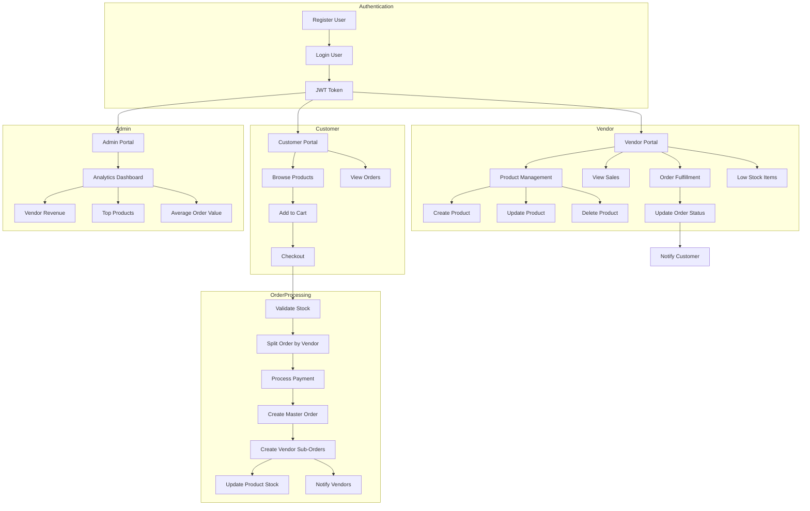
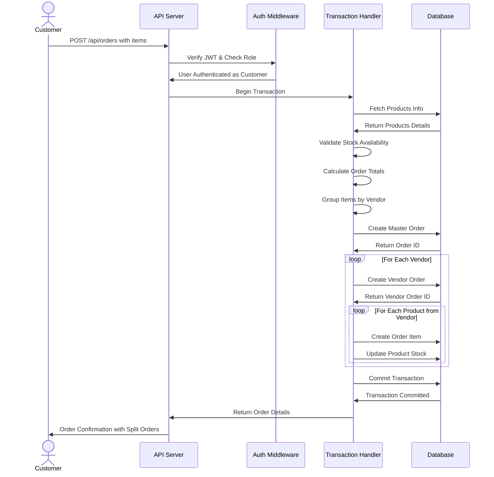

# Multi-Vendor Order Management System

A Node.js backend for a multi-vendor order management system where vendors can manage products, customers can place orders across multiple vendors, and the system automatically splits orders per vendor.

## Features

- **Authentication & RBAC**
  - JWT-based authentication
  - Role-based access control: Customer, Vendor, Admin

- **Product Management**
  - Vendors can create, update, and delete their products
  - Product fields: name, price, stock, category

- **Order Management**
  - Customers can place orders with items from multiple vendors
  - Orders are automatically split per vendor
  - Stock validation and transaction-safe stock updates

- **Analytics**
  - Admin: Revenue per vendor, top products, average order value
  - Vendor: Daily sales, low-stock items

## System Workflow Diagram


    
## Customer Sequence Diagram - Order Placement Flow




## Tech Stack

- Node.js & Express
- Prisma ORM with PostgreSQL
- JWT for authentication
- Bcrypt for password hashing
- Joi for validation

## Getting Started

### Prerequisites

- Node.js (v14+)
- PostgreSQL

### Installation

1. Clone the repository
   ```bash
   git clone <repository-url>
   cd multi-vendor-order-management
   ```

2. Install dependencies
   ```bash
   npm install
   ```

3. Set up environment variables
   ```bash
   # Update DATABASE_URL in .env with your PostgreSQL connection string example is given in .env.example
   # Refer .env.example file to add more secret info required to run this project
   ```

4. Run database migrations
   ```bash
   npx prisma migrate dev
   ```

5. Generate Prisma Client
   ```bash
   npx prisma generate
   ```

6. Start the development server
   ```bash
   npm run dev
   ```

## API Documentation

### Authentication

- **POST /api/auth/register** - Register a new user
- **POST /api/auth/login** - Login and get JWT token
- **GET /api/auth/profile** - Get user profile

### Products

- **GET /api/products** - Get all products
- **GET /api/products/:id** - Get product by ID
- **GET /api/products/vendor/my-products** - Get vendor's products
- **POST /api/products** - Create a new product (Vendor)
- **PUT /api/products/:id** - Update a product (Vendor)
- **DELETE /api/products/:id** - Delete a product (Vendor)

### Orders

- **POST /api/orders** - Create a new order (Customer)
- **GET /api/orders/customer/my-orders** - Get customer's orders
- **GET /api/orders/vendor/my-orders** - Get vendor's orders
- **GET /api/orders/:id** - Get order details
- **PATCH /api/orders/vendor/:id/status** - Update vendor order status

### Analytics

- **GET /api/analytics/admin/vendor-revenue** - Get revenue per vendor (Admin)
- **GET /api/analytics/admin/top-products** - Get top 5 products by sales (Admin)
- **GET /api/analytics/admin/average-order-value** - Get average order value (Admin)
- **GET /api/analytics/vendor/daily-sales** - Get vendor's daily sales (Vendor)
- **GET /api/analytics/vendor/low-stock** - Get vendor's low stock items (Vendor) 
